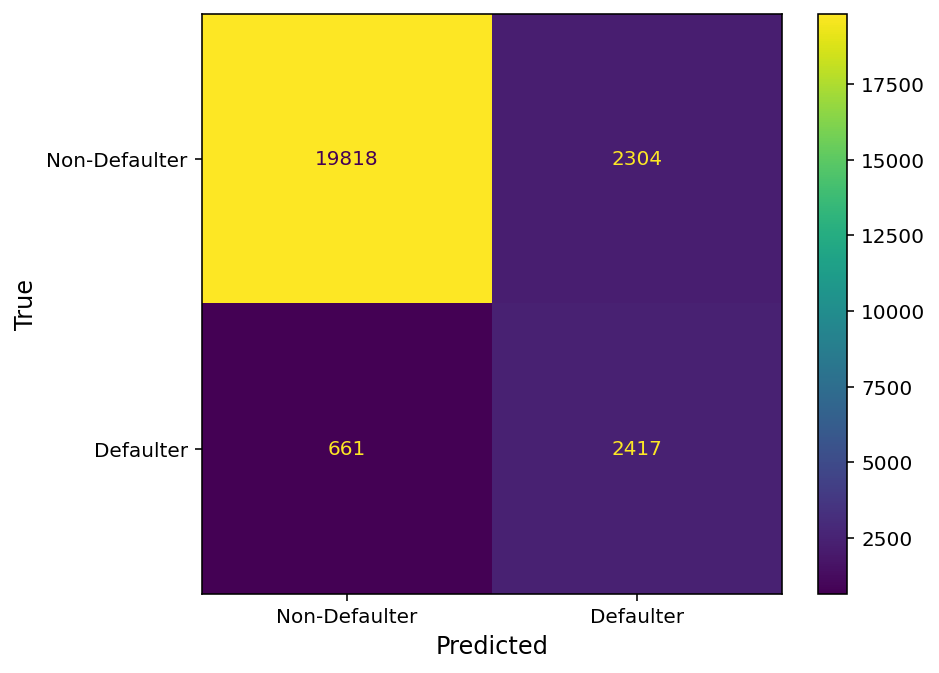
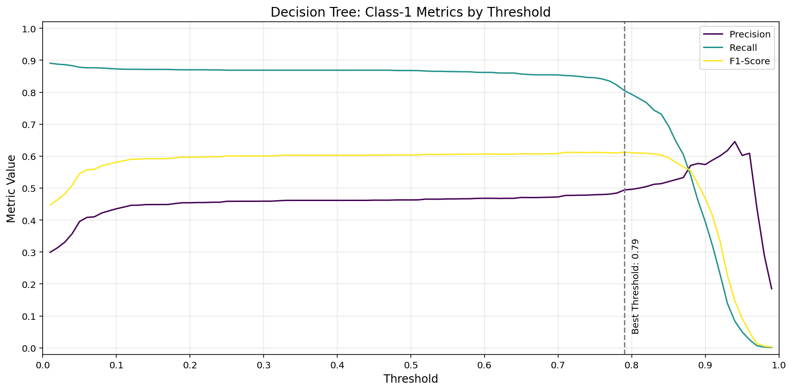
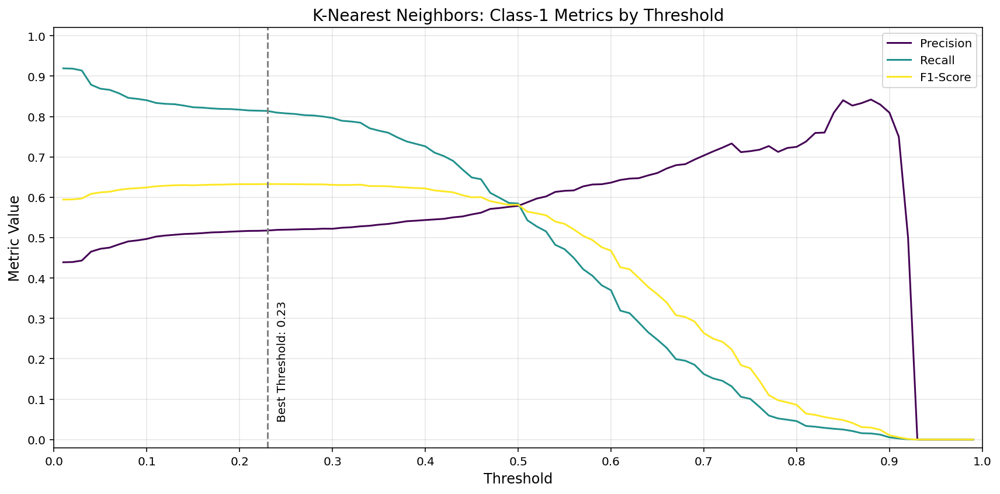

<!-- anchor tag for back-to-top links -->

<!-- HEADER IMAGE  -->

<!-- SHORT SUMMARY  -->
Leveraged machine learning to predict loan defaults from customer application data, helping financial institutions minimize risk and make data-driven lending decisions.

---

<!-- TABLE OF CONTENTS -->
## 📋 Table of Contents
<ol>
  <li>
    <a href="#-summary">Summary</a>
    <ul>
      <li><a href="#️-built-with">Built With</a></li>
    </ul>
  </li>
  <li>
    <a href="#-motivation">Motivation</a>
  </li>
  <li>
    <a href="#️-data">Data</a>
  </li>
  <li>
    <a href="#-data-preprocessing">Data Preprocessing</a>
  </li>
  <li>
    <a href="#-exploratory-data-analysis-eda">Exploratory Data Analysis (EDA)</a>
  </li>
  <li>
    <a href="#️-modeling">Modeling</a>
    <ul>
      <li><a href="#-baseline-models">Baseline Models</a></li>      
      <li><a href="#️-hyperparameter-tuning">Hyperparameter Tuning</a></li>
      <li><a href="#-final-model">Final Model</a></li>
    </ul>
  </li>
  <li>
    <a href="#️-license">License</a>
  </li>
  <li>
    <a href="#-credits">Credits</a>
  </li>
  <li>
    <a href="#-appendix">Appendix</a>
    <ul>
      <li><a href="#descriptive-statistics">Comparison Tables</a></li>      
      <li><a href="#comparison-tables">Comparison Tables</a></li>      
      <li><a href="#threshold-optimization">Threshold Optimization</a></li>
    </ul>
  </li>
</ol>

<!-- SUMMARY -->
## 🎯 Summary
This project aims to develop a machine learning model to predict whether the customers of a financial institution will default on a loan based on data from their loan application. By accurately identifying potential defaulters, financial institutions can make more informed lending decisions, reduce losses, improve profitability, and increase operational efficiency through the automation of risk assessment.

### 🛠️ Built With
- [![Python][Python-badge]][Python-url]
- [![Pandas][Pandas-badge]][Pandas-url]
- [![Matplotlib][Matplotlib-badge]][Matplotlib-url] 
- [![Seaborn][Seaborn-badge]][Seaborn-url]
- [![scikit-learn][scikit-learn-badge]][scikit-learn-url]
- [![Jupyter Notebook][JupyterNotebook-badge]][JupyterNotebook-url]

(<a href="#readme-top">back to top</a>)

<!-- MOTIVATION -->
## 💡 Motivation
**Problem**  
Predicting loan defaults is a challenging task due to the multitude of influencing factors such as customers' demographic, financial, location, and behavioral attributes. Traditional default prediction models often oversimplify complex relationships between customer features and default risk. Machine learning offers enhanced predictive capability by capturing non-linear patterns and intricate dependencies in loan application data, enabling more accurate predictions of loan default risk.

**Objectives**  
- Develop a machine learning model to predict loan defaults using customer data from loan applications.
- Compare multiple models (e.g., Logistic Regression, Random Forest, XGBoost).
  - Primary evaluation metric: Area Under the Precision-Recall Curve (AUC-PR), as it suits class imbalance (12.3% defaults) with a focus on preventing defaults.
  - Secondary evaluation metrics: Class-1-specific recall, precision, and F1-score.
  - Success criteria: Minimum class-1 recall of 0.75 and class-1 precision of 0.50 on the test data.
- Identify key factors influencing loan default risk through feature importance analysis.

**Value Proposition**  
This project enables financial institutions to reduce loan default rates and make better and faster lending decisions by leveraging machine learning for automated and improved risk assessment. 

**Business Goals**  
- Reduce losses by 5M-10M INR within 12 months of model deployment by decreasing the loan default rate by 10%-20%.
- Decrease loan processing time by 25%-40% by automating risk assessment, leading to less time spent on manual evaluations.
- Ensure 100% compliance with regulatory requirements and fair lending practices.

(<a href="#readme-top">back to top</a>)

<!-- DATA -->
## 🗂️ Data
The dataset contains information provided by customers of a financial institution during the loan application process. It is sourced from the "Loan Prediction Based on Customer Behavior" dataset by Subham Jain, available on [Kaggle](https://www.kaggle.com/datasets/subhamjain/loan-prediction-based-on-customer-behavior). Stored in `Training Data.csv`, it contains the features, target variable (`Risk Flag`), and `ID` column. 

Dataset Statistics:
- Dataset size: 252,000 records 
- Target variable: Risk flag (12.3% defaults)
- Features: 11 
  - Demographic: Age, married, profession
  - Financial: Income, house ownership, car ownership
  - Location: City, state
  - Behavioral: Experience, current job years, current house years

Data Overview Table:

| Column | Description | Storage Type | Semantic Type | Theoretical Range | Observed Range |
| :--- | :--- | :--- | :--- | :--- | :--- |
| Risk Flag | Defaulted on loan (0: No, 1: Yes) | Integer | Categorical (Binary) | [0, 1] | [0, 1] |
| Income | Income of the applicant | Integer | Numerical | [0, ∞] | [10K, 10M] |
| Age | Age of the applicant (in years) | Integer | Numerical | [18, ∞] | [21, 79] |
| Experience | Work experience (in years) | Integer | Numerical | [0, ∞] | [0, 20] |
| Profession | Applicant's profession | String | Categorical (Nominal) | Any profession [e.g., "Architect", "Dentist"] | 51 unique professions |
| Married | Marital status | String | Categorical (Binary) | ["single", "married"] | ["single", "married"] |
| House Ownership | Applicant owns or rents a house | String | Categorical (Nominal) | ["rented", "owned", "norent_noown"] | ["rented", "owned", "norent_noown"] |
| Car Ownership | Whether applicant owns a car | String | Categorical (Binary) | ["yes", "no"] | ["yes", "no"] |
| Current Job Years | Years in the current job | Integer | Numerical | [0, ∞] | [0, 14] |
| Current House Years | Years in the current house | Integer | Numerical | [0, ∞] | [10, 14] |
| City | City of residence | String | Categorical (Nominal) | Any city [e.g., "Mumbai", "Bangalore"] | 317 unique cities |
| State | State of residence | String | Categorical (Nominal) | Any state [e.g., "Maharashtra", "Tamil_Nadu"] | 29 unique states |

Example Data:

| Risk Flag | Income    | Age | Experience | Profession         | Married | House Ownership | Car Ownership | Current Job Years | Current House Years | City      | State         |
| :-------- | :-------- | :-- | :--------- | :----------------- | :------ | :-------------- | :------------ | :---------------- | :------------------ | :-------- | :------------ |
| 0         | 1,303,834 | 23  | 3          | Mechanical_engineer | single  | rented          | no            | 3                 | 13                   | Rewa      | Madhya_Pradesh |
| 1         | 6,256,451 | 41  | 2          | Software_Developer | single  | rented          | yes           | 2                 | 12                   | Bangalore | Tamil_Nadu    |
| 0         | 3,991,815 | 66  | 4          | Technical_writer   | married | rented          | no            | 4                 | 10                   | Alappuzha | Kerala        |

(<a href="#readme-top">back to top</a>)

<!-- DATA PREPROCESSING -->
## 🧹 Data Preprocessing
Used `pandas` and `sklearn` for data loading, cleaning, transformation, and saving.
- **Loaded data** from .csv file using `pandas` `read_csv`.
- **Standardized column names and labels** to `snake_case` using `pandas` string methods and `apply` with custom functions.
- **Handled duplicates**: Verified the absence of duplicates using both the ID column and complete row comparison.
- **Handled data types**: Converted string columns with two categories to boolean columns using `pandas` `map`.
- **Train-validation-test split**: Split data into training (80%), validation (10%), and test (10%) sets using `sklearn` `train_test_split`.
- **Engineered new features**:
    - Profession-based features: Derived job stability from profession and city tier from city using mapping functions with  `pandas` `map`. 
    - Location-based features: Derived state default rate from state using target encoding.
- **Defined semantic type** for each column (numerical, categorical, boolean).
- **Handled missing values**: Verified the absence of missing values in all columns in training, validation, and test data.
- **Handled outliers**: Identified multivariate outliers using `sklearn` `IsolationForest` and univariate outliers using statistical methods (3SD and 1.5 IQR) with custom transformer classes that inherit from `sklearn` `BaseEstimator` and `TransformerMixin`.
- **Feature scaling and encoding**:
    - Scaled numerical features: Used standard scaling with `sklearn` `StandardScaler`.
    - Encoded categorical features: Used one-hot encoding for nominal features (`sklearn` `OneHotEncoder`) and ordinal encoding for ordinal features (`OrdinalEncoder`).
    - Applied scaling and encoding together using `sklearn` `ColumnTransformer`.
- **Saved the preprocessed data** for training, validation, and test sets as .csv files using `pandas` `to_csv`.

(<a href="#readme-top">back to top</a>)

<!-- EXPLORATORY DATA ANALYSIS -->
## 🔍 Exploratory Data Analysis (EDA)
Used `pandas`, `numpy`, `seaborn`, and `matplotlib` for statistical analysis and visualizations.
- **Univariate EDA**:
    - **Numerical columns**:
        - Analyzed descriptive statistics (e.g., mean, median, standard deviation) using `pandas` `describe`. See [Appendix: Descriptive Statistics]().
        - Visualized distributions with histograms using `seaborn` `histplot` and `matplotlib`.
    - **Categorical columns**:
        - Examined frequencies using `pandas` `value_counts`.
        - Visualized frequency distributions with bar plots using `seaborn` `barplot` and `matplotlib`. 
- **Bivariate EDA**:
    - **Numerical x numerical**:
        - Analyzed pairwise relationships with a correlation matrix (`pandas` `corr` and `numpy`) and visualized them with a heatmap (`seaborn` `heatmap`).
        - Visualized relationships with scatterplots using `seaborn` `scatterplot` and `matplotlib`.
    - **Numerical x categorical**:
        - Explored relationships with group-wise statistics (e.g., mean or median by category) using `pandas` `groupby` and `agg`.
        - Quantified the magnitude of group differences with Cohen's d using a custom function.
        - Visualized results with bar plots using `seaborn` `barplot` and `matplotlib`.
    - **Categorical x categorical**:
        - Analyzed relationships with contingency tables using `pandas` `crosstab`.
        - Visualized relationships with grouped bar plots using `pandas` `crosstab` `plot` and `matplotlib`.

(<a href="#readme-top">back to top</a>)

## 🏗️ Modeling
Trained, evaluated, and optimized multiple models using `sklearn` and `xgboost`.

### 🧱 Baseline Models  
- Trained eight baseline models with default hyperparameter values.
- Trained each model with four outlier handling methods. 
- Evaluated model performance on the validation data using AUC-PR (primary metric), class-1 recall, precision, and F1-score (secondary metrics), and precision-recall curves. 

Proceeded without outlier handling, as it did not meaningfully improve AUC-PR.

The top-performing models were selected for hyperparameter tuning: Random Forest (AUC-PR: 0.62), XGBoost (0.56), K-Nearest Neighbors (0.56), and Decision Tree (0.47).

(<a href="#readme-top">back to top</a>)

### ⚙️ Hyperparameter Tuning  
Performed random search with 5-fold cross-validation using `sklearn` `RandomizedSearchCV`. Evaluated the best-performing model from each algorithm using precision-recall curves on the validation data. Random Forest demonstrated the highest AUC-PR (0.62), followed by XGBoost (0.61).  

**Threshold Optimization**  
Optimized decision thresholds of all tuned models to balance recall and precision based on business needs. For loan defaults, recall is often prioritized because missing a defaulter (a false negative) is costly. Determined the optimal thresholds by maximizing the F1-score while ensuring recall ≥ 0.80 and precision ≥ 0.40. The plot below shows threshold optimization for Random Forest. For all model plots, see [Appendix: Threshold Optimization](#threshold-optimization).

Compared performance of hyperparameter-tuned models with optimized decision thresholds on the validation data. Random Forest and XGBoost demonstrated the highest F1-score (0.64) while meeting minimum recall (0.80) and exceeding precision (0.54 vs. min. 0.40).
| Model               | AUC-PR | Recall (Class 1) | Precision (Class 1) | F1-Score (Class 1) | Accuracy |
|---------------------|--------|------------------|---------------------|-------------------|----------|
| K-Nearest Neighbors | 0.59   | 0.81             | 0.52                | 0.63              | 0.88     |
| Decision Tree       | 0.52   | 0.81             | 0.49                | 0.61              | 0.87     |
| Random Forest       | 0.62   | 0.80             | 0.54                | 0.64              | 0.89     |
| XGBoost             | 0.61   | 0.80             | 0.54                | 0.64              | 0.89     |

Diagnosed overfitting of optimized threshold models by comparing training and validation performance. Random Forest showed the lowest AUC-PR difference (0.06) compared to XGBoost (0.13), Decision Tree (0.13), and KNN (0.26).

**Model Selection**: Random Forest for its good performance, low overfitting, and interpretability.
- Performance: Highest AUC-PR (0.62) and F1-score (0.64, tied with XGBoost), meeting minimum recall and precision.
- Overfitting: Lowest AUC-PR difference between training and validation (0.06).  
- Interpretability: Higher degree of interpretability than XGBoost, crucial for transparency and regulatory compliance in finance.  

(<a href="#readme-top">back to top</a>)

### 🏆 Final Model
**Random Forest** with a decision threshold of 0.29 and the following hyperparameters:
- `n_estimators=225`
- `max_depth=26`
- `min_samples_split=2`
- `min_samples_leaf=1`
- `max_features=0.13`
- `class_weight="balanced"`

Compared evaluation metrics of the final Random Forest model between training, validation, and test data. The performance drop from validation to test was small, suggesting consistent model behavior on unseen data.
| Data       | AUC-PR | Recall (Class 1) | Precision (Class 1) | F1-Score (Class 1) | Accuracy |
|------------|--------|--------------------|---------------------|--------------------|----------|
| Training   | 0.68   | 1.00               | 0.62                | 0.77               | 0.93     |
| Validation | 0.62   | 0.80               | 0.54                | 0.64               | 0.89     |
| Test       | 0.59   | 0.79               | 0.51                | 0.62               | 0.88     |

Evaluated model performance on test data using a classification report and confusion matrix. The model met the project-defined success criteria, achieving recall ≥ 0.75 and precision ≥ 0.50 for defaulters on unseen data.
|                        | Precision | Recall | F1-Score | Samples |
|------------------------|-----------|--------|----------|---------|
| Class 0: Non-Defaulter | 0.97      | 0.90   | 0.93     | 22122   |
| Class 1: Defaulter     | 0.51      | 0.79   | 0.62     | 3078    |
| Accuracy               |           |        | 0.88     | 25200   |
| Macro Avg              | 0.74      | 0.84   | 0.78     | 25200   |
| Weighted Avg           | 0.91      | 0.88   | 0.89     | 25200   |

**Feature Importance**  
The most influential features were income, age, and state default rate, indicating that financial stability and regional risk factors heavily influence loan defaults. Other factors like experience and current job years also contributed moderately, while demographic factors like car ownership and marital status had minimal impact.

**Model Prediction Examples**  
The table below illustrates model performance on test data by highlighting best examples (correct, high confidence), worst examples (incorrect, high confidence), and typical examples (average confidence). The model demonstrated reliable predictions on typical cases but displayed problematic overconfidence on misclassified edge cases.
| Example | Income | Age | State Default Rate | Experience | Current Job Yrs | Actual Default | Predicted Default | Confidence | Misclassification |
|---------|-----------|---- |------------|------------|----------|----------|----------|------------|------------|
| Best    | 495,619   | 26  | 12.8%      | 1          | 1        | Yes      | Yes      | 99%        | ✅ No     |
| Best    | 2,901,323 | 56  | 13.7%      | 2          | 2        | No       | No       | 100%       | ✅ No     |
| Worst   | 8,290,834 | 42  | 12.8%      | 3          | 3        | Yes      | No       | 95%        | ❌ Yes    |
| Worst   | 7,644,982 | 24  | 12.2%      | 1          | 1        | No       | Yes      | 98%        | ❌ Yes    |
| Typical | 4,570,845 | 47  | 15.5%      | 3          | 3        | Yes      | Yes      | 94%        | ✅ No     |
| Typical | 8,391,288 | 24  | 11.7%      | 4          | 4        | No       | No       | 94%        | ✅ No     |

(<a href="#readme-top">back to top</a>)

<!-- LICENSE -->
## ©️ License
This project is licensed under the [MIT License](LICENSE).

(<a href="#readme-top">back to top</a>)

<!-- CREDITS -->
## 👏 Credits
This project was made possible with the help of the following resources:
- **Header image**: Generated using the FLUX.1 [dev] image generator via [Hugging Face](https://huggingface.co/spaces/black-forest-labs/FLUX.1-dev) by [Black Forest Labs](https://blackforestlabs.ai/).

(<a href="#readme-top">back to top</a>)

<!-- APPENDIX -->
## 📎 Appendix
### Descriptive Statistics

### Comparison Tables
**Baseline Models (No Outlier Handling)**
| Model                  | AUC-PR | Recall (Class 1) | Precision (Class 1) | F1-Score (Class 1) | Accuracy |
|------------------------|--------|------------------|----------------------|--------------------|----------|
| Logistic Regression    | 0.16   | 0.00             | 0.00                 | 0.00               | 0.88     |
| Elastic Net            | 0.16   | 0.00             | 0.00                 | 0.00               | 0.88     |
| K-Nearest Neighbors    | 0.53   | 0.50             | 0.56                 | 0.53               | 0.89     |
| Support Vector Machine | 0.13   | 0.28             | 0.13                 | 0.18               | 0.67     |
| Neural Network         | 0.32   | 0.10             | 0.51                 | 0.17               | 0.88     |
| Decision Tree          | 0.46   | 0.57             | 0.52                 | 0.55               | 0.88     |
| Random Forest          | 0.60   | 0.53             | 0.60                 | 0.56               | 0.90     |
| XGBoost                | 0.54   | 0.20             | 0.64                 | 0.30               | 0.89     |

**Hyperparameter-Tuned Models (Default Thresholds)**
| Model               | AUC-PR | Recall (Class 1) | Precision (Class 1) | F1-Score (Class 1) | Accuracy |
|---------------------|--------|------------------|---------------------|-------------------|----------|
| K-Nearest Neighbors | 0.59   | 0.54             | 0.59                | 0.56              | 0.89     |
| Decision Tree       | 0.52   | 0.87             | 0.46                | 0.60              | 0.86     |
| Random Forest       | 0.62   | 0.77             | 0.57                | 0.65              | 0.90     |
| XGBoost             | 0.61   | 0.81             | 0.53                | 0.64              | 0.89     |

**Hyperparameter-Tuned Models (Optimized Thresholds)**
| Model               | AUC-PR | Recall (Class 1) | Precision (Class 1) | F1-Score (Class 1) | Accuracy |
|---------------------|--------|------------------|---------------------|-------------------|----------|
| K-Nearest Neighbors | 0.59   | 0.81             | 0.52                | 0.63              | 0.88     |
| Decision Tree       | 0.52   | 0.81             | 0.49                | 0.61              | 0.87     |
| Random Forest       | 0.62   | 0.80             | 0.54                | 0.64              | 0.89     |
| XGBoost             | 0.61   | 0.80             | 0.54                | 0.64              | 0.89     |

(<a href="#readme-top">back to top</a>)

### Threshold Optimization
**Random Forest**

**XGBoost**

**Decision Tree**

**K-Nearest Neighbors**

(<a href="#readme-top">back to top</a>)

<!-- MARKDOWN LINKS -->
[Python-badge]: https://img.shields.io/badge/python-3670A0?style=for-the-badge&logo=python&logoColor=ffdd54
[Python-url]: https://www.python.org/
[Pandas-badge]: https://img.shields.io/badge/pandas-%23150458.svg?style=for-the-badge&logo=pandas&logoColor=white
[Pandas-url]: https://pandas.pydata.org/
[Matplotlib-badge]: https://img.shields.io/badge/Matplotlib-%23f0f0f0.svg?style=for-the-badge&logo=Matplotlib&logoColor=black
[Matplotlib-url]: https://matplotlib.org/
[Seaborn-badge]: https://img.shields.io/badge/seaborn-%230C4A89.svg?style=for-the-badge&logo=seaborn&logoColor=white
[Seaborn-url]: https://seaborn.pydata.org/
[scikit-learn-badge]: https://img.shields.io/badge/scikit--learn-%23F7931E.svg?style=for-the-badge&logo=scikit-learn&logoColor=white
[scikit-learn-url]: https://scikit-learn.org/stable/
[JupyterNotebook-badge]: https://img.shields.io/badge/Jupyter-F37626.svg?style=for-the-badge&logo=Jupyter&logoColor=white
[JupyterNotebook-url]: https://jupyter.org/