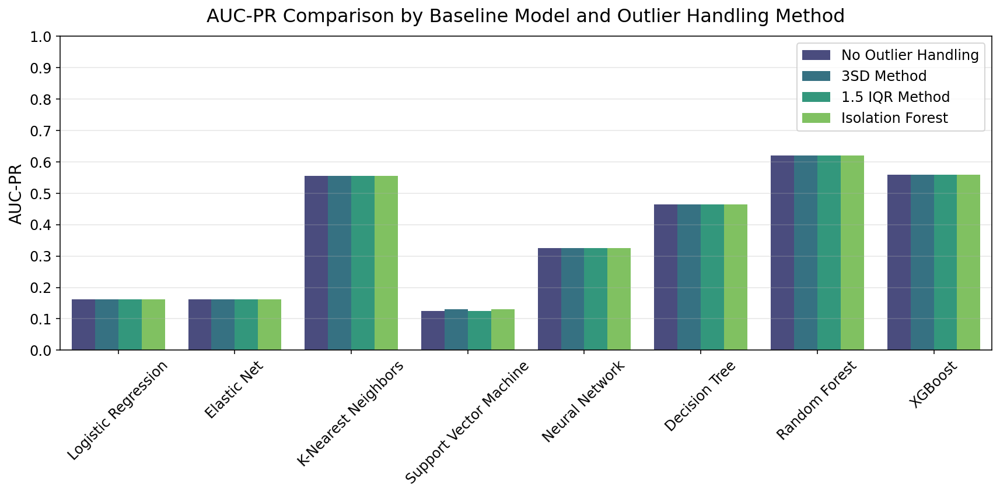
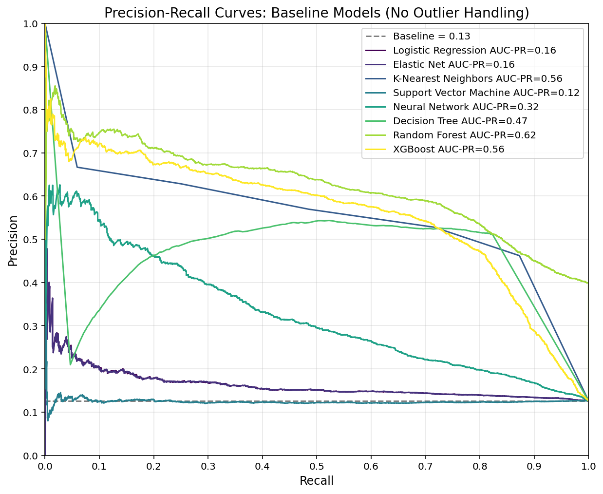
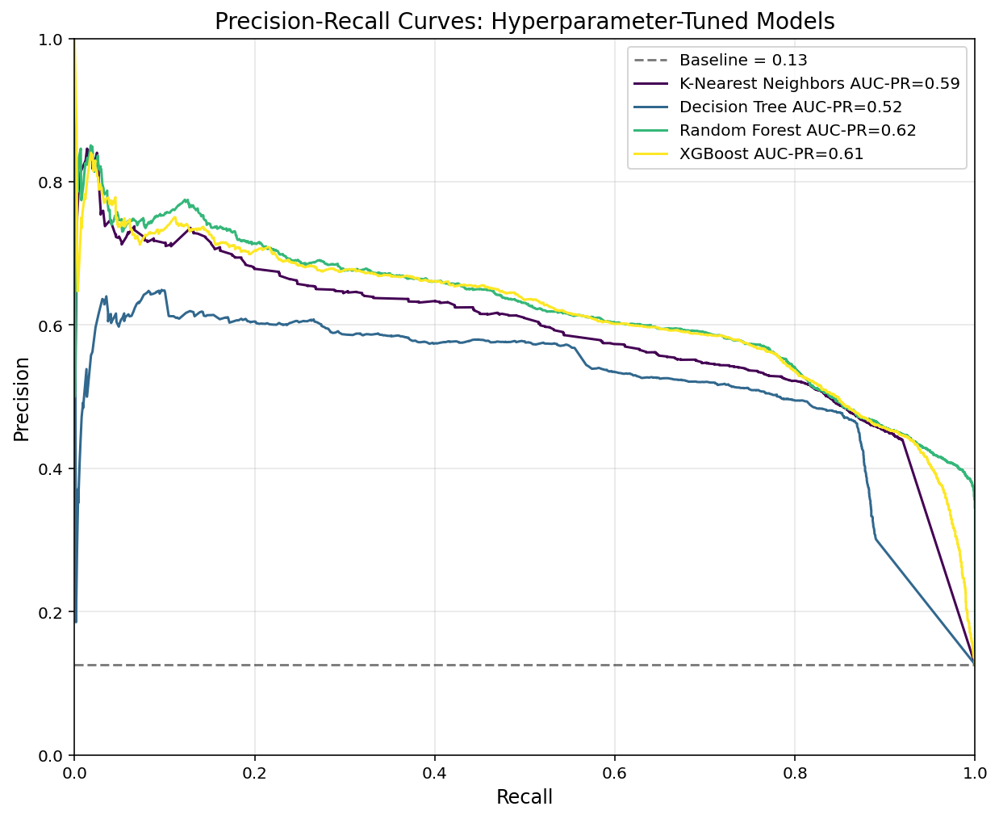
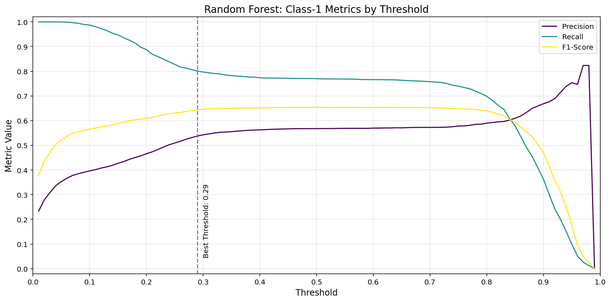
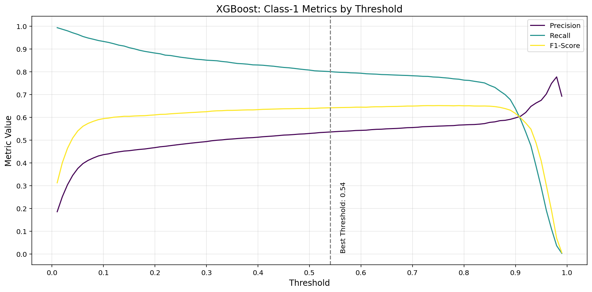

<!-- anchor tag for back-to-top links -->

<!-- HEADER IMAGE  -->

<!-- SHORT SUMMARY  -->
Leveraged machine learning to predict loan defaults from customer application data, helping financial institutions minimize risk and make data-driven lending decisions.

---

<!-- TABLE OF CONTENTS -->
## 📋 Table of Contents
<ol>
  <li>
    <a href="#-summary">Summary</a>
    <ul>
      <li><a href="#️-built-with">Built With</a></li>
    </ul>
  </li>
  <li>
    <a href="#-motivation">Motivation</a>
  </li>
  <li>
    <a href="#️-data">Data</a>
  </li>
  <li>
    <a href="#-data-preprocessing">Data Preprocessing</a>
  </li>
  <li>
    <a href="#-exploratory-data-analysis-eda">Exploratory Data Analysis (EDA)</a>
  </li>
  <li>
    <a href="#-modeling">Modeling</a>
    <ul>
      <li><a href="#️-baseline-models">Baseline Models</a></li>      
      <li><a href="#️-hyperparameter-tuning">Hyperparameter Tuning</a></li>
      <li><a href="#-final-model">Final Model</a></li>
    </ul>
  </li>
  <li>
    <a href="#️-license">License</a>
  </li>
  <li>
    <a href="#-credits">Credits</a>
  </li>
</ol>

<!-- SUMMARY -->
## 🎯 Summary
This project aims to develop a machine learning model to predict whether the customers of a financial institution will default on a loan based on data from their loan application. By accurately identifying potential defaulters, financial institutions can make more informed lending decisions, reduce losses, improve profitability, and increase operational efficiency through the automation of risk assessment.

### 🛠️ Built With
- [![Python][Python-badge]][Python-url]
- [![Pandas][Pandas-badge]][Pandas-url]
- [![Matplotlib][Matplotlib-badge]][Matplotlib-url] 
- [![Seaborn][Seaborn-badge]][Seaborn-url]
- [![scikit-learn][scikit-learn-badge]][scikit-learn-url]
- [![Jupyter Notebook][JupyterNotebook-badge]][JupyterNotebook-url]

(<a href="#readme-top">back to top</a>)

<!-- MOTIVATION -->
## 💡 Motivation
**Problem**  
Predicting loan defaults is a challenging task due to the multitude of influencing factors such as customers' demographic, financial, location, and behavioral attributes. Traditional default prediction models often oversimplify complex relationships between customer features and default risk. Machine learning offers enhanced predictive capability by capturing non-linear patterns and intricate dependencies in loan application data, enabling more accurate predictions of loan default risk.

**Objectives**  
- Develop a machine learning model to predict loan defaults using customer data from loan applications.
- Compare multiple models (e.g., Logistic Regression, Random Forest, XGBoost) using a suitable evaluation metric (such as AUC-PR).
- Identify key factors influencing loan default risk through feature importance analysis.

**Value Proposition**  
This project enables financial institutions to reduce loan default rates and make better and faster lending decisions by leveraging machine learning for automated and improved risk assessment. 

**Business Goals**  
- Reduce losses by 5M-10M INR within 12 months of model deployment by decreasing the loan default rate by 10%-20%.
- Decrease loan processing time by 25%-40% by automating risk assessment, leading to less time spent on manual evaluations.
- Ensure 100% compliance with regulatory requirements and fair lending practices.

(<a href="#readme-top">back to top</a>)

<!-- DATA -->
## 🗂️ Data
The dataset contains information provided by customers of a financial institution during the loan application process. It is sourced from the "Loan Prediction Based on Customer Behavior" dataset by Subham Jain, available on [Kaggle](https://www.kaggle.com/datasets/subhamjain/loan-prediction-based-on-customer-behavior). The dataset consists of three `.csv` files:
1. `Training Data.csv`: Contains the features, target variable (`Risk Flag`), and `ID` column from the training data. 
2. `Test Data.csv`: Contains the features and `ID` column from the test data.
3. `Sample Prediction Dataset.csv`: Contains the target variable (`Risk Flag`) and `ID` column from the test data. 

Dataset Statistics:
- Training set size: 252,000 records 
- Test set size: 28,000 records 
- Target variable: Risk flag (training: 12.3% defaults, test: 12.8% defaults)
- Features: 11 
  - Demographic: Age, married, profession
  - Financial: Income, house ownership, car ownership
  - Location: City, state
  - Behavioral: Experience, current job years, current house years

Data Overview Table:

| Column | Description | Storage Type | Semantic Type | Theoretical Range | Training Data Range |
| :--- | :--- | :--- | :--- | :--- | :--- |
| Risk Flag | Defaulted on loan (0: No, 1: Yes) | Integer | Categorical (Binary) | [0, 1] | [0, 1] |
| Income | Income of the applicant | Integer | Numerical | [0, ∞] | [10K, 10M] |
| Age | Age of the applicant (in years) | Integer | Numerical | [18, ∞] | [21, 79] |
| Experience | Work experience (in years) | Integer | Numerical | [0, ∞] | [0, 20] |
| Profession | Applicant's profession | String | Categorical (Nominal) | Any profession [e.g., "Architect", "Dentist"] | 51 unique professions |
| Married | Marital status | String | Categorical (Binary) | ["single", "married"] | ["single", "married"] |
| House Ownership | Applicant owns or rents a house | String | Categorical (Nominal) | ["rented", "owned", "norent_noown"] | ["rented", "owned", "norent_noown"] |
| Car Ownership | Whether applicant owns a car | String | Categorical (Binary) | ["yes", "no"] | ["yes", "no"] |
| Current Job Years | Years in the current job | Integer | Numerical | [0, ∞] | [0, 14] |
| Current House Years | Years in the current house | Integer | Numerical | [0, ∞] | [10, 14] |
| City | City of residence | String | Categorical (Nominal) | Any city [e.g., "Mumbai", "Bangalore"] | 317 unique cities |
| State | State of residence | String | Categorical (Nominal) | Any state [e.g., "Maharashtra", "Tamil_Nadu"] | 29 unique states |

Example Training Data:

| Risk Flag | Income    | Age | Experience | Profession         | Married | House Ownership | Car Ownership | Current Job Years | Current House Years | City      | State         |
| :-------- | :-------- | :-- | :--------- | :----------------- | :------ | :-------------- | :------------ | :---------------- | :------------------ | :-------- | :------------ |
| 0         | 1,303,834 | 23  | 3          | Mechanical_engineer | single  | rented          | no            | 3                 | 13                   | Rewa      | Madhya_Pradesh |
| 1         | 6,256,451 | 41  | 2          | Software_Developer | single  | rented          | yes           | 2                 | 12                   | Bangalore | Tamil_Nadu    |
| 0         | 3,991,815 | 66  | 4          | Technical_writer   | married | rented          | no            | 4                 | 10                   | Alappuzha | Kerala        |

(<a href="#readme-top">back to top</a>)

<!-- DATA PREPROCESSING -->
## 🧹 Data Preprocessing
Used `pandas` and `sklearn` for data loading, cleaning, transformation, and saving.
- **Loaded data** from three .csv files using `pandas` `read_csv`.
- **Standardized column names and labels** to `snake_case` using `pandas` string methods and `apply` with custom functions.
- **Merged datasets** using `pandas` `merge`.
- **Handled duplicates**: No duplicate rows identified based on the ID column or all columns.
- **Handled data types**: Converted string columns with two unique categories to boolean columns using `pandas` `map`.
- **Train-validation-test split**: Split data into training (80%), validation (10%), and test (10%) sets using `sklearn` `train_test_split`.
- **Engineered new features**:
    - Profession-based features: Derived job stability from profession and city tier from city using mapping functions with  `pandas` `map`. 
    - Location-based features: Derived state default rate from state using target encoding.
- **Defined semantic type** of columns (numerical, categorical, boolean).
- **Handled missing values**: No missing values identified in any column in training, validation, and test data.
- **Handled outliers**: Identified multivariate outliers using `sklearn` `IsolationForest` and univariate outliers using statistical methods (3SD and 1.5 IQR) with custom transformer classes that inherit from `sklearn` `BaseEstimator` and `TransformerMixin`.
- **Feature scaling and encoding**:
    - Scaled numerical features: Used standard scaling with `sklearn` `StandardScaler`.
    - Encoded categorical features: Used one-hot encoding for nominal features (`sklearn` `OneHotEncoder`) and ordinal encoding for ordinal features (`OrdinalEncoder`).
    - Applied scaling and encoding together using `sklearn` `ColumnTransformer`.
- **Saved the preprocessed data** as .csv files using `pandas` `to_csv`.

(<a href="#readme-top">back to top</a>)

<!-- EXPLORATORY DATA ANALYSIS -->
## 🔍 Exploratory Data Analysis (EDA)
Used `pandas`, `numpy`, `seaborn`, and `matplotlib` for statistical analysis and visualizations.
- **Univariate EDA**:
    - **Numerical columns**:
        - Analyzed descriptive statistics (e.g., mean, median, standard deviation) using `pandas` `describe`.
        - Visualized distributions with histograms using `seaborn` `histplot` and `matplotlib`.
    - **Categorical columns**:
        - Examined frequencies using `pandas` `value_counts`.
        - Visualized frequencies with bar plots using `seaborn` `barplot` and `matplotlib`. 
- **Bivariate EDA**:
    - **Numerical x numerical**:
        - Analyzed pairwise relationships with a correlation matrix (`pandas` `corr` and `numpy`) and visualized them with a heatmap (`seaborn` `heatmap`).
        - Visualized relationships with scatterplots using `seaborn` `scatterplot` and `matplotlib`.
    - **Numerical x categorical**:
        - Explored relationships with group-wise statistics (e.g., mean or median by category) using `pandas` `groupby` and `agg`.
        - Quantified the magnitude of group differences with Cohen's d using a custom function.
        - Visualized results with bar plots using `seaborn` `barplot` and `matplotlib`.
    - **Categorical x categorical**:
        - Analyzed relationships with contingency tables using `pandas` `crosstab`.
        - Visualized relationships with grouped bar plots using `pandas` `crosstab` `plot` and `matplotlib`.

(<a href="#readme-top">back to top</a>)

## 🧠 Modeling
Used `sklearn`, `xgboost`, and `pickle` for model training, evaluation, and saving.

### 🏗️ Baseline Models  
- Trained eight baseline models (default hyperparameter values) with four outlier handling methods. 
- Evaluated model performance on the validation data: 
  - Primary metric: AUC-PR.
  - Secondary metrics: Class-1-specific recall, precision, and F1-score.

Decided to proceed without outlier handling, as it did not improve AUC-PR.

**Comparison table** of evaluation metrics for all baseline models (no outlier handling):
| Model                  | AUC-PR | Recall (Class 1) | Precision (Class 1) | F1-Score (Class 1) | Accuracy |
|------------------------|--------|------------------|----------------------|--------------------|----------|
| Logistic Regression    | 0.16   | 0.00             | 0.00                 | 0.00               | 0.88     |
| Elastic Net            | 0.16   | 0.00             | 0.00                 | 0.00               | 0.88     |
| K-Nearest Neighbors    | 0.53   | 0.50             | 0.56                 | 0.53               | 0.89     |
| Support Vector Machine | 0.13   | 0.28             | 0.13                 | 0.18               | 0.67     |
| Neural Network         | 0.32   | 0.10             | 0.51                 | 0.17               | 0.88     |
| Decision Tree          | 0.46   | 0.57             | 0.52                 | 0.55               | 0.88     |
| Random Forest          | 0.60   | 0.53             | 0.60                 | 0.56               | 0.90     |
| XGBoost                | 0.54   | 0.20             | 0.64                 | 0.30               | 0.89     |

**Precision-recall curves** of all baseline models (no outlier handling):  

Identified Random Forest, XGBoost, K-Nearest Neighbors, and Decision Tree as the top performers (highest AUC-PR and class-1-specific recall, precision, and f1-score) for hyperparameter tuning.

(<a href="#readme-top">back to top</a>)

### ⚙️ Hyperparameter Tuning  
Performed random search with 5-fold cross-validation using `sklearn` `RandomizedSearchCV`.  

**Comparison table** of evaluation metrics for tuned models (no outlier handling):
| Model                | AUC-PR | Recall (Class 1) | Precision (Class 1) | F1-Score (Class 1) | Accuracy |
|----------------------|--------|------------------|----------------------|--------------------|----------|
| K-Nearest Neighbors | 0.57   | 0.53             | 0.57                 | 0.55               | 0.89     |
| Decision Tree       | 0.56   | 0.00             | 0.00                 | 0.00               | 0.88     |
| Random Forest       | 0.60   | 0.76             | 0.56                 | 0.64               | 0.90     |
| XGBoost            | 0.60   | 0.79             | 0.51                 | 0.62               | 0.88     |

**Precision-recall curves** of tuned models (no outlier handling):  

Random Forest and XGBoost demonstrate the best AUC-PR.

**Threshold Optimization**  
Prioritized recall over precision, because missing a defaulter (false negative) is generally more costly than flagging a non-defaulter as risky (false positive). Determined the best threshold that optimizes the F1-score while satisfying a minimum recall of 0.80 and a minimum precision of 0.50. 

Random Forest and XGBoost, with optimized decision thresholds, show similar performance. Selected Random Forest as the final model, given its interpretability and regulatory compliance advantages in the financial sector. 

(<a href="#readme-top">back to top</a>)

### 🏆 Final Model
**Random Forest** with a decision threshold of 0.26 and the following hyperparameters:
- `n_estimators=225`
- `max_depth=26`
- `min_samples_split=2`
- `min_samples_leaf=1`
- `max_features=0.13`
- `class_weight="balanced"`

**Feature Importance**:  
The plot highlights the top ten predictors of loan default, with income (0.22) and age (0.20) as the most influential features, followed by state default rate (0.15). Job-related features like experience (0.13), current years in the job (0.12) and job stability (0.05) also play a strong role. 

(<a href="#readme-top">back to top</a>)

<!-- LICENSE -->
## ©️ License
This project is licensed under the [MIT License](LICENSE).

(<a href="#readme-top">back to top</a>)

<!-- CREDITS -->
## 👏 Credits
This project was made possible with the help of the following resources:
- **Header image**: Generated using the FLUX.1 [dev] image generator via [Hugging Face](https://huggingface.co/spaces/black-forest-labs/FLUX.1-dev) by [Black Forest Labs](https://blackforestlabs.ai/).

(<a href="#readme-top">back to top</a>)

<!-- MARKDOWN LINKS -->
[Python-badge]: https://img.shields.io/badge/python-3670A0?style=for-the-badge&logo=python&logoColor=ffdd54
[Python-url]: https://www.python.org/
[Pandas-badge]: https://img.shields.io/badge/pandas-%23150458.svg?style=for-the-badge&logo=pandas&logoColor=white
[Pandas-url]: https://pandas.pydata.org/
[Matplotlib-badge]: https://img.shields.io/badge/Matplotlib-%23f0f0f0.svg?style=for-the-badge&logo=Matplotlib&logoColor=black
[Matplotlib-url]: https://matplotlib.org/
[Seaborn-badge]: https://img.shields.io/badge/seaborn-%230C4A89.svg?style=for-the-badge&logo=seaborn&logoColor=white
[Seaborn-url]: https://seaborn.pydata.org/
[scikit-learn-badge]: https://img.shields.io/badge/scikit--learn-%23F7931E.svg?style=for-the-badge&logo=scikit-learn&logoColor=white
[scikit-learn-url]: https://scikit-learn.org/stable/
[JupyterNotebook-badge]: https://img.shields.io/badge/Jupyter-F37626.svg?style=for-the-badge&logo=Jupyter&logoColor=white
[JupyterNotebook-url]: https://jupyter.org/